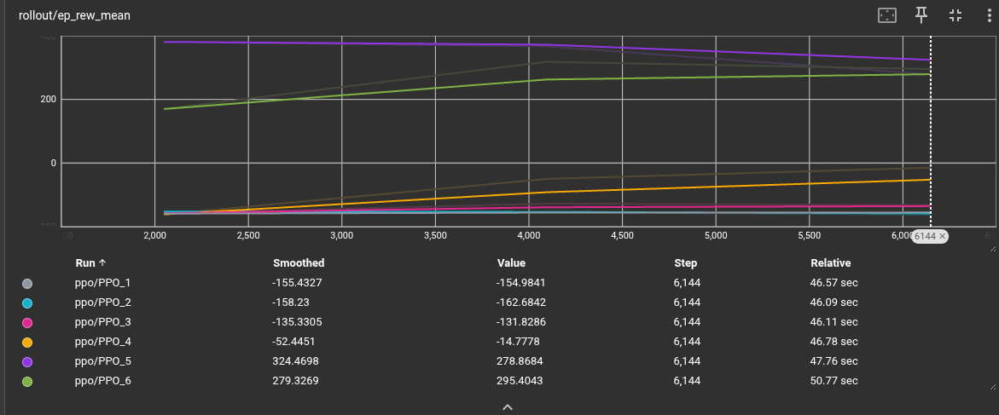
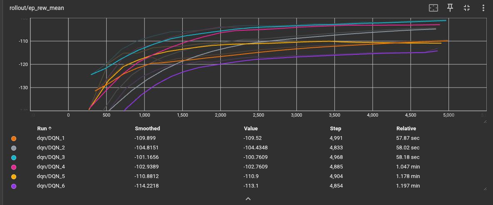
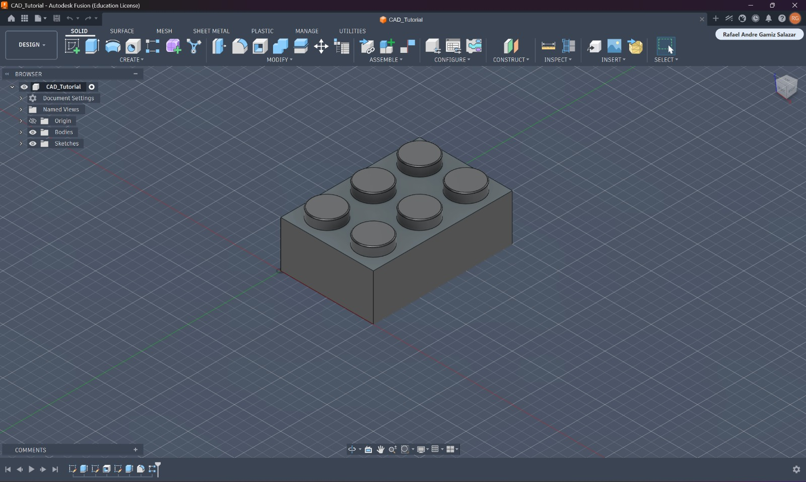

# Reinforcement Learning Navigation with ROS 2 and Flatland

This project implements a reinforcement learning navigation task using ROS 2, Flatland, Gymnasium, and Stable-Baselines3.

The robot learns to navigate through a hallway environment using LiDAR data and three discrete actions:
- Move forward
- Rotate left
- Rotate right

Two reinforcement learning algorithms were tested:
- PPO (Proximal Policy Optimization)
- DQN (Deep Q-Network)


## RL Environment Design

The environment is implemented in [`serp_rl/__init__.py`](serp_rl/__init__.py) as `SerpControllerEnv`, a class that is both a ROS 2 `Node` and a Gymnasium `Env`.

- **Observation space**: the robot's 90-ray LiDAR (`/static_laser`) is grouped into **9 sections**, each reporting the minimum distance in that section, clipped to the range `[0.0, 2.0]` meters. Readings are also taken from a second LiDAR (`/end_beacon_laser`) purely to detect the goal beacon and are not part of the observation.
- **Action space**: 3 discrete actions:
  | Action | Linear speed | Angular speed |
  |---|---|---|
  | 0 — Move forward | 0.5 m/s | 0.0 rad/s |
  | 1 — Rotate left | 0.0 m/s | 1.5708 rad/s |
  | 2 — Rotate right | 0.0 m/s | -1.5708 rad/s |
- **Reward function**:
  - `-200` and episode **terminated** on collision (detected via the `/collisions` Bumper plugin).
  - `400 + (200 - step_number)` and episode **terminated** when the robot gets within `0.02 m` of the goal beacon (faster completions score higher).
  - `-300` and episode **truncated** after `200` steps without reaching the goal.
  - `+2` for moving forward, `0` for turning, on every other step.
- **Episode reset**: the robot and the goal beacon swap between two fixed positions, `(0.0, 0.0)` and `(1.6, 1.6)`, on every reset, using Flatland's `/move_model` service.
- **Training loop**: `run_rl_alg()` trains in blocks of `5000` timesteps, then evaluates `20` deterministic test episodes, and repeats until the success rate reaches `80%` accuracy. The model is saved to disk after every block.

## Requirements / Installation

This package targets **ROS 2 Humble** and depends on [Flatland](https://github.com/JoaoCostaIFG/flatland) (2D robot simulator) being present in the same workspace.

1. **ROS 2 Humble** installed and sourced (`/opt/ros/humble/setup.bash`).

2. **Clone this package and Flatland into your workspace's `src/`:**
   ```bash
   cd ~/ros2_ws/src
   git clone <this-repo-url> ros2_flatland_rl_tutorial
   git clone https://github.com/JoaoCostaIFG/flatland.git
   ```

3. **Python dependencies** (RL stack, not covered by rosdep):
   ```bash
   pip install gymnasium stable-baselines3 tensorboard
   ```

4. **Build and source the workspace:**
   ```bash
   cd ~/ros2_ws
   colcon build
   source install/setup.bash
   ```

## Running the Simulation

Run from your workspace root (`~/ros2_ws`), since model saving uses a path relative to it:

```bash
cd ~/ros2_ws
ros2 launch serp_rl serp_rl.launch.py
```


## Switching Between PPO and DQN

The training algorithm is a launch argument, `algorithm`, defaulting to `dqn`:

```bash
ros2 launch serp_rl serp_rl.launch.py algorithm:=ppo
ros2 launch serp_rl serp_rl.launch.py algorithm:=dqn
```

Internally this sets a ROS parameter on the `serp_rl` node (see `ALGORITHMS` in [`serp_rl/__init__.py`](serp_rl/__init__.py)), which picks the Stable-Baselines3 class, the TensorBoard log folder (`results/tensorboard_logs/<algorithm>/`), and the saved model path (`results/models/<algorithm>.zip`).

## TensorBoard Monitoring

```bash
cd src/ros2_flatland_rl_tutorial/results
tensorboard --logdir tensorboard_logs
```

Open in browser:

```text
http://localhost:6006
```

## Saving Training Logs

Run from the workspace root, so the log lands directly in this package's `results/` folder:

```bash
ros2 launch serp_rl serp_rl.launch.py algorithm:=ppo | tee src/ros2_flatland_rl_tutorial/results/ppo_log.txt
ros2 launch serp_rl serp_rl.launch.py algorithm:=dqn | tee src/ros2_flatland_rl_tutorial/results/dqn_log.txt
```

# Results

All training results and evidence were stored inside the `results/` folder.

## Included Evidence

- `ppo_log.txt` and `dqn_log.txt`
  - Terminal training logs for both algorithms.
  - Include rewards, timesteps, episode information, and evaluation accuracy.

- `graphs/`
  - TensorBoard screenshots showing reward evolution and training metrics for PPO and DQN.

- `tensorboard_logs/`
  - Raw TensorBoard event files generated during training.

- `models/`
  - Saved trained models:
    - `ppo.zip`
    - `dqn.zip`

## Observed Behavior

Two reinforcement learning algorithms were tested:
- PPO (Proximal Policy Optimization)
- DQN (Deep Q-Network)

The PPO and DQN algorithms showed different learning behaviors during training.

### PPO Results


The PPO reward curves showed more stable learning behavior throughout training. Some PPO runs gradually increased from negative rewards to strongly positive reward values, reaching values above 250. This indicates that the agent successfully learned how to navigate the environment, avoid collisions, and reach the target more consistently.

Although some PPO runs remained negative, the best-performing runs demonstrated clear learning improvement and better final performance overall.

### DQN Results


The DQN reward curves showed faster initial changes in reward values, but all runs remained in the negative reward region during the tested training time. The rewards improved gradually from approximately -140 to around -100, showing that the agent was learning some navigation behavior, but it still struggled with collisions and unsuccessful episodes.

DQN also showed more uniform behavior between runs, but it did not achieve the positive reward values reached by PPO.

### Comparison

Overall, PPO achieved better final performance and more successful learning behavior in this navigation task. PPO was able to reach positive rewards, indicating successful task completion more frequently, while DQN mainly reduced negative rewards without fully converging to successful navigation behavior during the tested training duration.

# CAD Tutorial

## LEGO Piece CAD Model

As part of the activity, a simple LEGO piece was modeled in CAD by following the tutorial shown in class. The activity focused on practicing basic CAD operations such as sketching, dimensions, extrusion, and feature creation.

The process started by defining the parameters and dimensions used for each sketch. First, the base rectangle of the LEGO piece was created, and then the stud feature was added. After that, a stud pattern was generated according to the dimensions of the rectangle to complete the LEGO design.

The `CAD_tutorial/` folder includes:
- The CAD model exported as an `.stl` file
- A screenshot/render of the final LEGO piece design

## CAD Visualization


